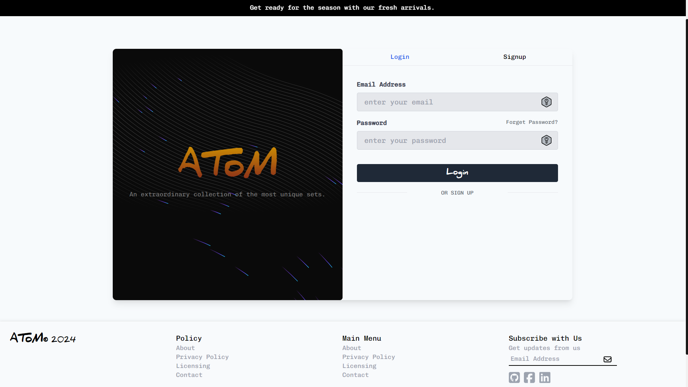
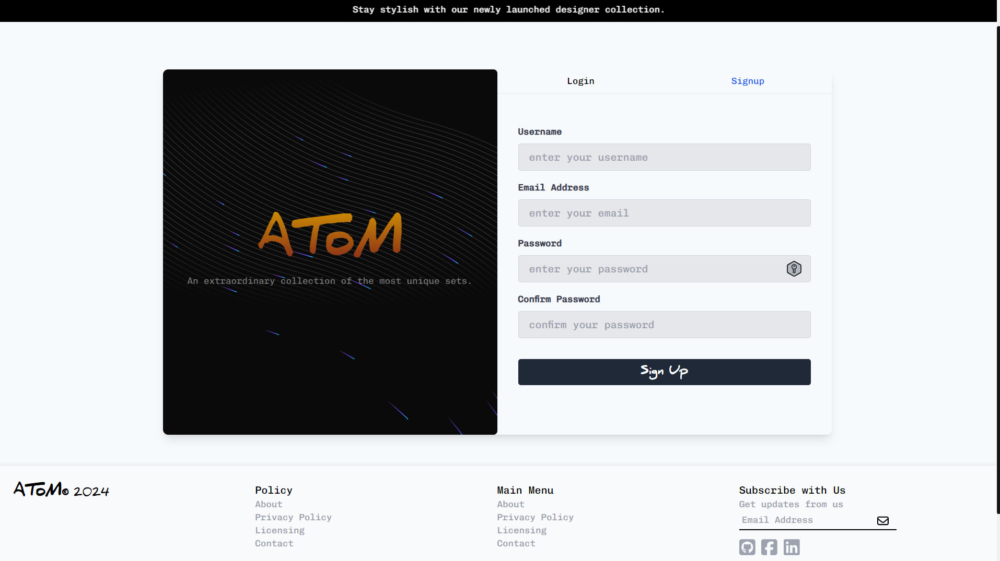
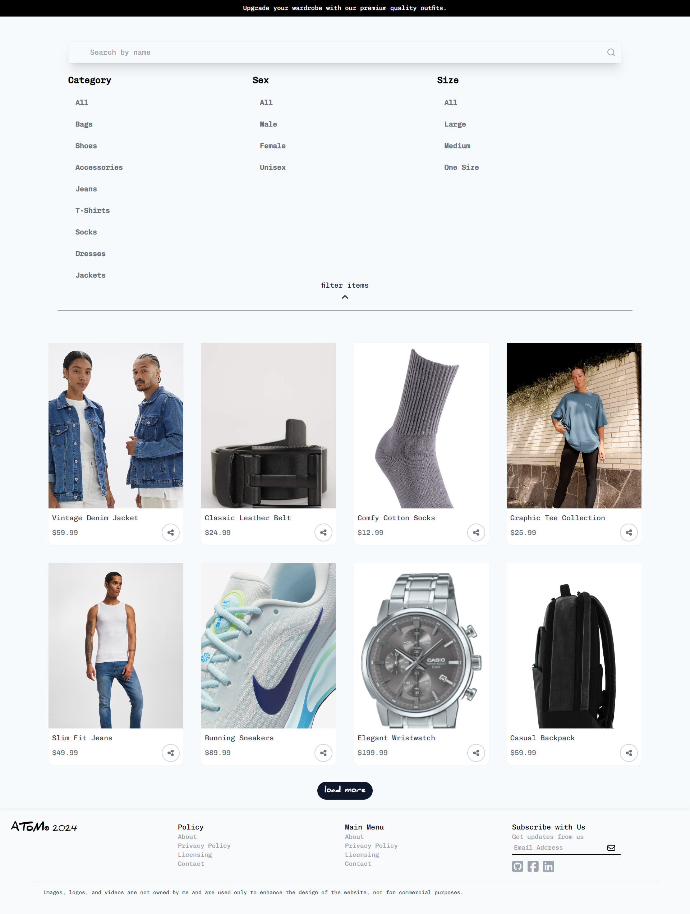
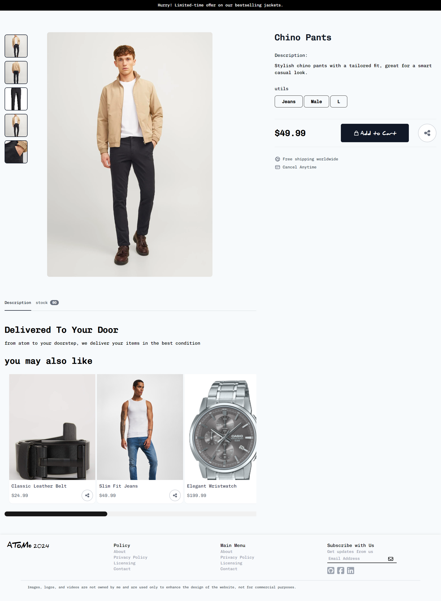
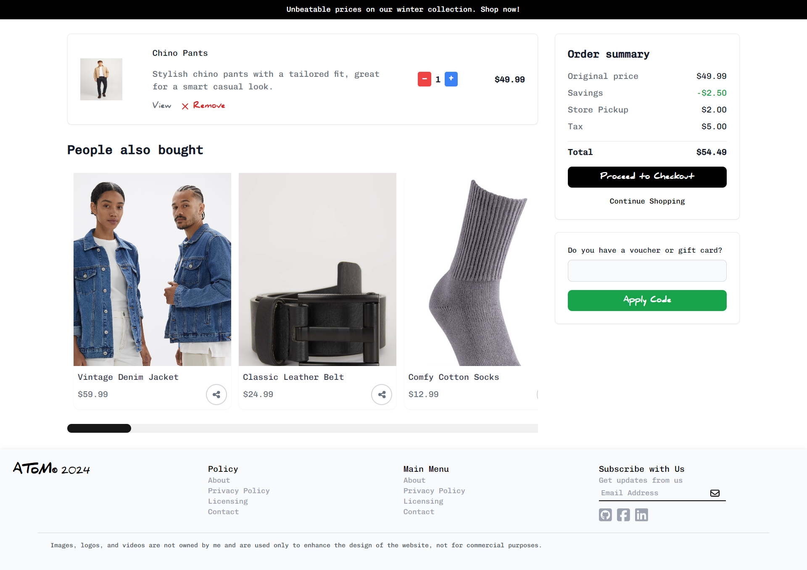
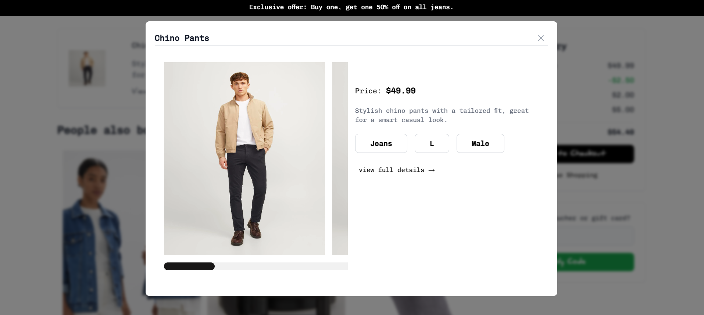
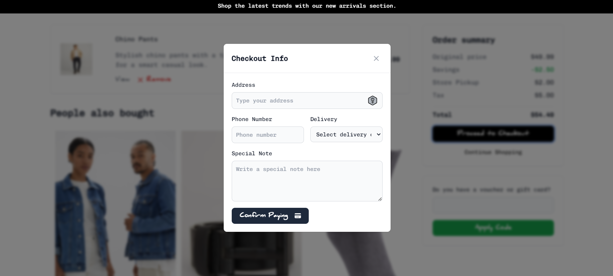
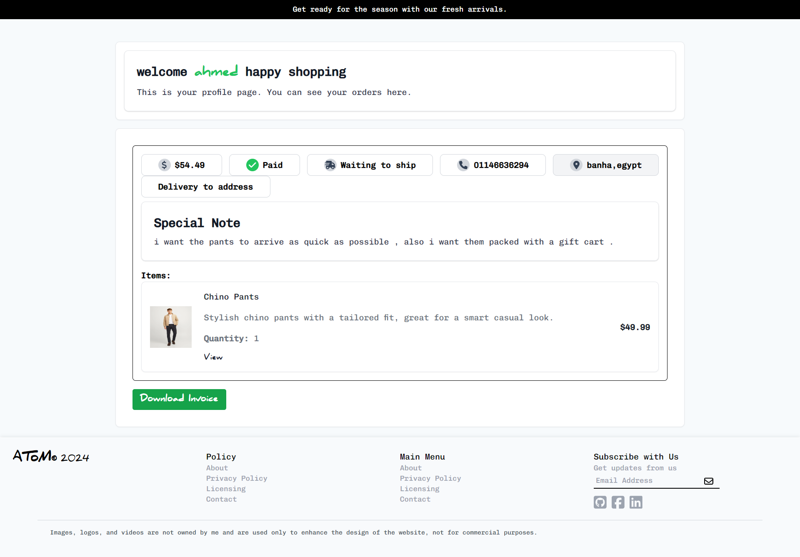
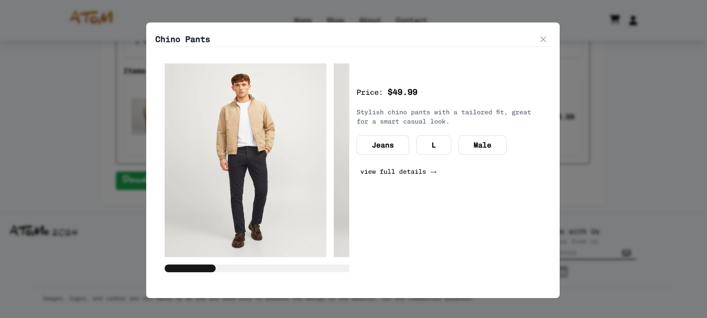

# ATOM ECOMMERCE

## Pages

### Home Page
- 
- 

### Auth Page
- 
- 

### Items Page
- 

### Item Details Page
- 

### Cart Page
- 
- 
- 

### User Profile Page
- 
- 

### About Us Page
- 

### Contact Page
- 

# ATOM BACKEND

## API Endpoints

### Users
- **POST `/signup`** - Registers a new user.
- **POST `/login`** - Authenticates a user and returns a token.
- **GET `/getAllUsers`** - Retrieves a list of all users.
- **POST `/forgetpassword`** - Sends a password reset link to the user's email.
- **PATCH `/resetpassword`** - Resets the user's password using a token.
- **GET `/logout`** - Logs out the current user.
- **GET `/getCurrentUser`** - Retrieves the currently logged-in user's information.
- **GET `/verifyCurrentLoggedInUser`** - Verifies if the current user is logged in.

### Admin
- **GET `/getAllAdmins`** - Retrieves a list of all admins.
- **POST `/signUpAdmin`** - Registers a new admin.
- **POST `/loginAdmin`** - Authenticates an admin and returns a token.
- **GET `/logout`** - Logs out the current admin.

### Item
- **GET `/getAllItems`** - Retrieves a list of all items.
- **GET `/getOneItem`** - Retrieves a single item by its ID.
- **GET `/filterItems`** - Filters items based on specific criteria.
- **GET `/createItem`** - Creates a new item.

### Cart
- **GET `/getAllCart`** - Retrieves the contents of the user's cart.
- **PATCH `/sendItemToCart`** - Adds an item to the user's cart.
- **PATCH `/removeFromCart`** - Removes an item from the user's cart.
- **GET `/getOneUserCart`** - Retrieves the cart for a specific user.
- **PATCH `/removeOneItemInstances`** - Removes one instance of an item from the user's cart.

### Orders
- **GET `/checkout`** - Initiates the checkout process for the user's cart.
- **GET `/getUserOrders`** - Retrieves the order history of the user.
